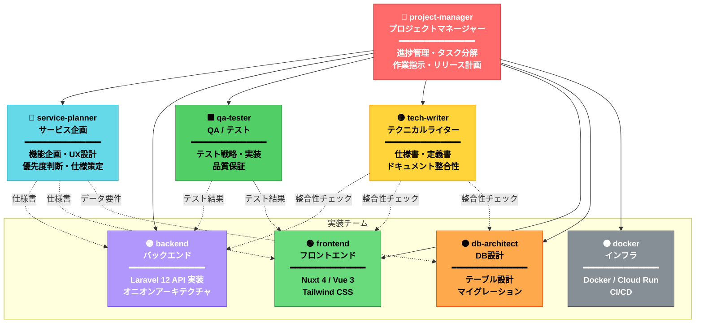

# エージェント組織図

最終更新: 2026-03-11

## 組織構成



## 指揮系統（実線）

| 上位 | 下位 | 関係 |
|------|------|------|
| **project-manager** | service-planner | 企画の依頼・優先度の最終決定 |
| **project-manager** | backend | API 実装タスクの指示 |
| **project-manager** | frontend | UI 実装タスクの指示 |
| **project-manager** | db-architect | DB 設計・マイグレーションの指示 |
| **project-manager** | docker | インフラ・CI/CD の指示 |
| **project-manager** | qa-tester | テスト計画・実行の指示 |
| **project-manager** | tech-writer | ドキュメント更新の指示 |

## 連携関係（点線）

| 発信元 | 受信先 | 連携内容 |
|--------|--------|---------|
| service-planner | backend, frontend | 機能仕様書のインプット |
| service-planner | db-architect | データ要件の伝達 |
| qa-tester | backend, frontend | テスト結果・不具合報告のフィードバック |
| tech-writer | backend, frontend, db-architect | ドキュメントと実装の差分報告 |

## 作業フロー

```
① 企画フェーズ
   service-planner → 機能仕様書を作成

② 計画フェーズ
   project-manager → タスク分解・優先度決定・担当割り当て

③ 設計フェーズ
   db-architect → テーブル設計・マイグレーション作成

④ 実装フェーズ
   backend  → Domain → Application → Infrastructure → Presentation
   frontend → 型定義 → composable → ページ/コンポーネント
   docker   → 必要に応じてインフラ更新

⑤ 検証フェーズ
   qa-tester → テスト設計・実行・不具合報告

⑥ 文書化フェーズ
   tech-writer → API仕様書・DB定義書・機能仕様の更新

⑦ リリース判定
   project-manager → 品質チェック・リリース承認
```
