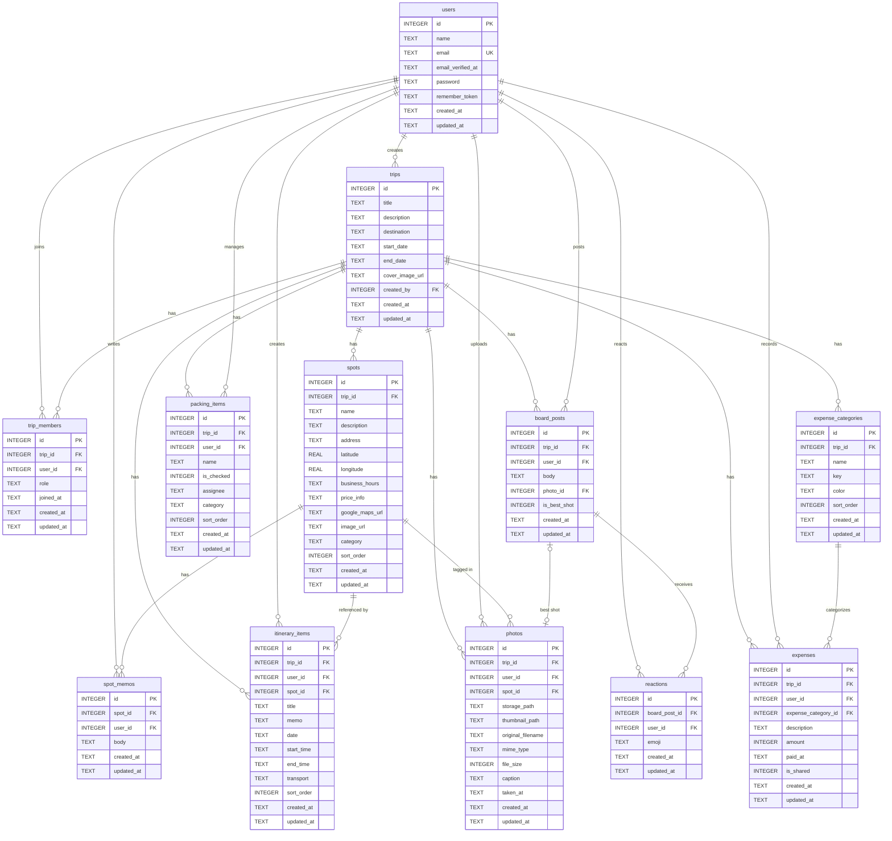

# ER図（Entity-Relationship Diagram）

## 概要

伊勢旅行アプリのデータベース ER図。
Mermaid 記法で記述する。全12テーブルのリレーションを表す。

---

## ER図

---

## リレーション一覧

| # | 親テーブル | 子テーブル | 外部キー | 関係 | 説明 |
|---|-----------|-----------|---------|------|------|
| 1 | users | trips | created_by | 1:N | ユーザーが旅行を作成 |
| 2 | users | trip_members | user_id | 1:N | ユーザーが旅行に参加 |
| 3 | trips | trip_members | trip_id | 1:N | 旅行にメンバーが所属 |
| 4 | trips | spots | trip_id | 1:N | 旅行にスポットが紐づく |
| 5 | trips | itinerary_items | trip_id | 1:N | 旅行にしおり項目が紐づく |
| 6 | trips | photos | trip_id | 1:N | 旅行に写真が紐づく |
| 7 | trips | board_posts | trip_id | 1:N | 旅行に掲示板投稿が紐づく |
| 8 | trips | packing_items | trip_id | 1:N | 旅行にパッキング項目が紐づく |
| 9 | trips | expense_categories | trip_id | 1:N | 旅行に費用カテゴリが紐づく |
| 10 | trips | expenses | trip_id | 1:N | 旅行に費用記録が紐づく |
| 11 | users | spot_memos | user_id | 1:N | ユーザーがスポットメモを投稿 |
| 12 | users | itinerary_items | user_id | 1:N | ユーザーがしおり項目を作成 |
| 13 | users | photos | user_id | 1:N | ユーザーが写真をアップロード |
| 14 | users | board_posts | user_id | 1:N | ユーザーが掲示板に投稿 |
| 15 | users | reactions | user_id | 1:N | ユーザーがリアクション |
| 16 | users | packing_items | user_id | 1:N | ユーザーがパッキング項目を管理 |
| 17 | users | expenses | user_id | 1:N | ユーザーが費用を記録 |
| 18 | spots | spot_memos | spot_id | 1:N | スポットにメモが紐づく |
| 19 | spots | itinerary_items | spot_id | 1:N | スポットがしおり項目から参照される |
| 20 | spots | photos | spot_id | 1:N | スポットに写真が紐づく |
| 21 | expense_categories | expenses | expense_category_id | 1:N | カテゴリに費用記録が紐づく |
| 22 | board_posts | reactions | board_post_id | 1:N | 投稿にリアクションが紐づく |
| 23 | photos | board_posts | photo_id | 1:1 | ベストショット写真が投稿に紐づく |

---

## 外部キー制約の ON DELETE 方針

| 外部キー | ON DELETE | 理由 |
|---------|-----------|------|
| trips.created_by | CASCADE | ユーザー削除時に旅行も削除 |
| trip_members.trip_id | CASCADE | 旅行削除時にメンバーも削除 |
| trip_members.user_id | CASCADE | ユーザー削除時にメンバーレコードも削除 |
| spots.trip_id | CASCADE | 旅行削除時にスポットも削除 |
| spot_memos.user_id | CASCADE | ユーザー削除時にメモも削除 |
| spot_memos.spot_id | CASCADE | スポット削除時にメモも削除 |
| itinerary_items.trip_id | CASCADE | 旅行削除時にしおりも削除 |
| itinerary_items.user_id | CASCADE | ユーザー削除時にしおりも削除 |
| itinerary_items.spot_id | SET NULL | スポット削除時もしおり項目は残す |
| photos.trip_id | CASCADE | 旅行削除時に写真メタデータも削除 |
| photos.user_id | CASCADE | ユーザー削除時に写真メタデータも削除 |
| photos.spot_id | SET NULL | スポット削除時も写真は残す |
| board_posts.trip_id | CASCADE | 旅行削除時に投稿も削除 |
| board_posts.user_id | CASCADE | ユーザー削除時に投稿も削除 |
| board_posts.photo_id | SET NULL | 写真削除時も投稿は残す |
| reactions.board_post_id | CASCADE | 投稿削除時にリアクションも削除 |
| reactions.user_id | CASCADE | ユーザー削除時にリアクションも削除 |
| packing_items.trip_id | CASCADE | 旅行削除時にパッキング項目も削除 |
| packing_items.user_id | CASCADE | ユーザー削除時にパッキング項目も削除 |
| expense_categories.trip_id | CASCADE | 旅行削除時にカテゴリも削除 |
| expenses.trip_id | CASCADE | 旅行削除時に費用記録も削除 |
| expenses.user_id | CASCADE | ユーザー削除時に費用記録も削除 |
| expenses.expense_category_id | RESTRICT | カテゴリ削除時に費用記録が存在する場合は削除拒否 |

---

## テーブル定義書

各テーブルの詳細定義は [テーブル定義書 索引](./table/index.md) を参照。
