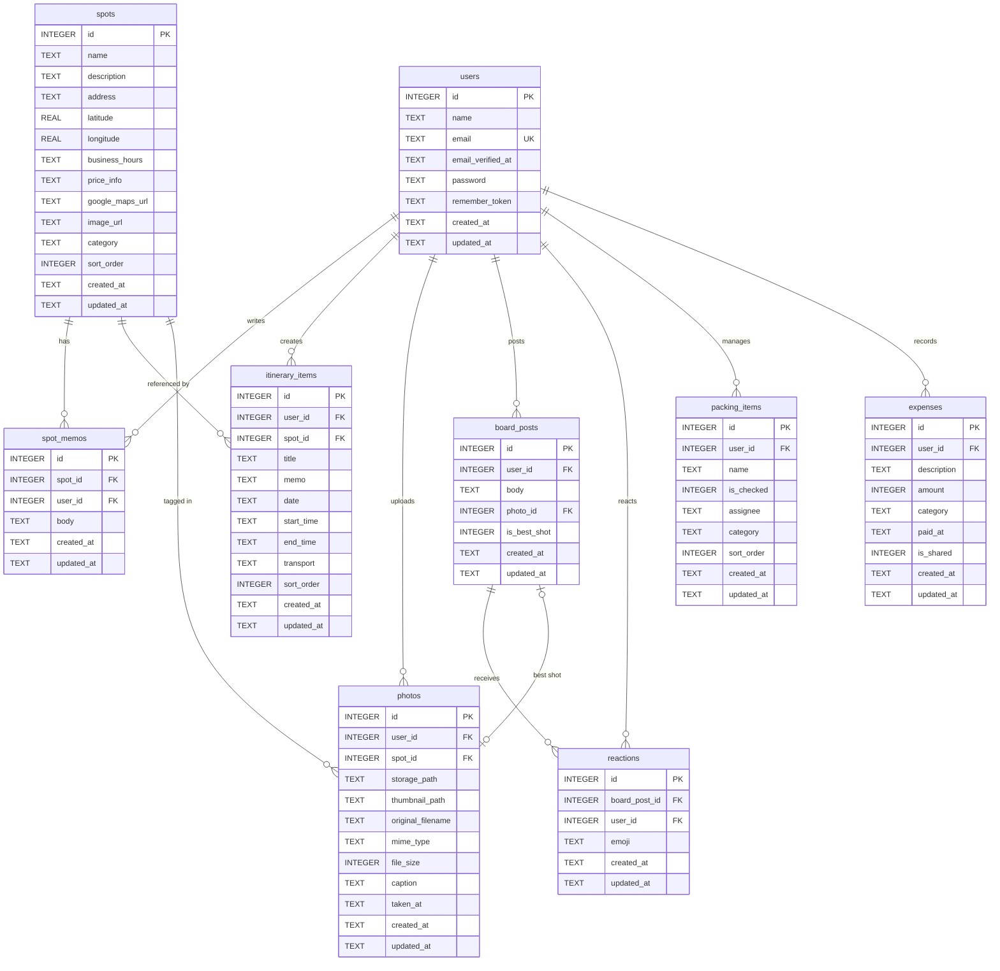

# ER図（Entity-Relationship Diagram）

## 概要

伊勢旅行アプリのデータベース ER図。
Mermaid 記法で記述する。全9テーブルのリレーションを表す。

---

## ER図

---

## リレーション一覧

| # | 親テーブル | 子テーブル | 外部キー | 関係 | 説明 |
|---|-----------|-----------|---------|------|------|
| 1 | users | spot_memos | user_id | 1:N | ユーザーがスポットメモを投稿 |
| 2 | users | itinerary_items | user_id | 1:N | ユーザーがしおり項目を作成 |
| 3 | users | photos | user_id | 1:N | ユーザーが写真をアップロード |
| 4 | users | board_posts | user_id | 1:N | ユーザーが掲示板に投稿 |
| 5 | users | reactions | user_id | 1:N | ユーザーがリアクション |
| 6 | users | packing_items | user_id | 1:N | ユーザーがパッキング項目を管理 |
| 7 | users | expenses | user_id | 1:N | ユーザーが費用を記録 |
| 8 | spots | spot_memos | spot_id | 1:N | スポットにメモが紐づく |
| 9 | spots | itinerary_items | spot_id | 1:N | スポットがしおり項目から参照される |
| 10 | spots | photos | spot_id | 1:N | スポットに写真が紐づく |
| 11 | board_posts | reactions | board_post_id | 1:N | 投稿にリアクションが紐づく |
| 12 | photos | board_posts | photo_id | 1:1 | ベストショット写真が投稿に紐づく |

---

## 外部キー制約の ON DELETE 方針

| 外部キー | ON DELETE | 理由 |
|---------|-----------|------|
| spot_memos.user_id | CASCADE | ユーザー削除時にメモも削除 |
| spot_memos.spot_id | CASCADE | スポット削除時にメモも削除 |
| itinerary_items.user_id | CASCADE | ユーザー削除時にしおりも削除 |
| itinerary_items.spot_id | SET NULL | スポット削除時もしおり項目は残す |
| photos.user_id | CASCADE | ユーザー削除時に写真メタデータも削除 |
| photos.spot_id | SET NULL | スポット削除時も写真は残す |
| board_posts.user_id | CASCADE | ユーザー削除時に投稿も削除 |
| board_posts.photo_id | SET NULL | 写真削除時も投稿は残す |
| reactions.board_post_id | CASCADE | 投稿削除時にリアクションも削除 |
| reactions.user_id | CASCADE | ユーザー削除時にリアクションも削除 |
| packing_items.user_id | CASCADE | ユーザー削除時にパッキング項目も削除 |
| expenses.user_id | CASCADE | ユーザー削除時に費用記録も削除 |

---

## テーブル定義書

各テーブルの詳細定義は [テーブル定義書 索引](./table/index.md) を参照。
